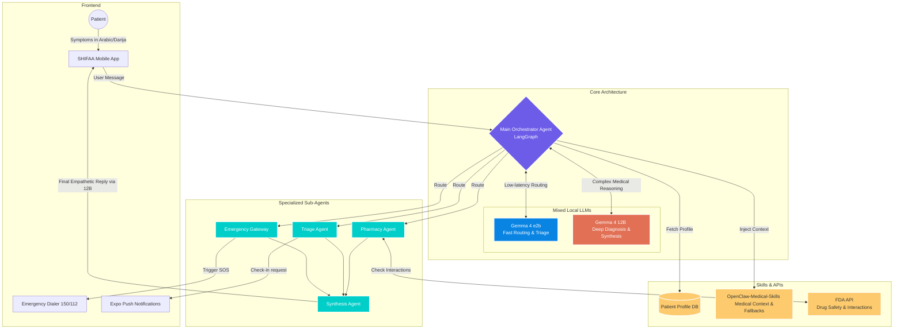

# SHIFAA: Multi-Agent Medical Orchestrator Platform 🏥

SHIFAA is an ultra-fast, privacy-first, local-LLM-powered medical orchestrator platform. It consists of a backend API (LangGraph-based), a web frontend, and a React Native mobile application. 

The system is designed to triage patients, manage medication queries, and trigger emergency protocols with **sub-second latency**, all powered securely by **Local Gemma 4** models.

---

## 🏗️ 1. Architecture Overview

The SHIFAA backend utilizes a **Multi-Agent Graph (LangGraph)** architecture. Instead of relying on a single monolithic prompt, incoming patient messages are routed dynamically to specialized AI agents (Triage, Pharmacy, Emergency). These agents execute their specific medical skills and return structured JSON, which is then synthesized into a final, empathetic response in the patient's native language (Arabic/Darija/French).

### Visual Architecture Diagram


---

## 🤖 2. The Multi-Agent System

### Sub-Agents
| Agent | Responsibility | Key Features |
| :--- | :--- | :--- |
| **🚨 Emergency Gateway** | Intercepts critical symptoms (e.g., chest pain). | Triggers `isEmergency: true`, activating native mobile SOS dials (e.g., 150). |
| **🩺 Triage Agent** | Assesses non-critical symptoms and chronic conditions. | Evaluates severity and extracts natural language follow-up timers (e.g., "Check in 10s"). |
| **💊 Pharmacy Agent** | Handles medication queries and dosage checks. | Queries external medical APIs (FDA) for safety constraints. |
| **✍️ Synthesis Agent** | Combines outputs from multiple agents. | Formats the final text in warm, empathetic Arabic/Darija using the 12B model. |

---

## ⚡ 3. Sub-Second Latency Optimizations

SHIFAA employs 5 distinct optimization layers to process complex medical queries in under 1-2 seconds.

### Latency Optimization Pipeline
```mermaid
graph TD
    User([User Message & Raw Patient Profile])
    
    subgraph 1. Input Optimization
        Profile[Compact Profile Formatter <br> <i>Compresses JSON to 1-line string <br> Reduces input tokens by 90%</i>]
    end

    subgraph 2. Execution Layer
        LLM[Gemma 4 e2b <br> <i>Ultra-fast routing & triage execution</i>]
    end

    subgraph 3. Output Processing
        Strip[Reasoning Stripper <br> <i>Regex removes think tags instantly</i>]
        RegexJSON[Targeted JSON Extraction <br> <i>Regex isolates JSON objects <br> Bypasses syntax errors</i>]
    end

    subgraph 4. Routing Optimization
        Check{How many agents <br> activated?}
        Bypass[Single-Agent Passthrough <br> <i>Skips Synthesis Node <br> Cuts time by 50%</i>]
        Synthesis[Synthesis Node <br> <i>Only used for multi-agent</i>]
    end
    
    Final([Sub-Second Final Response])

    %% Flow
    User --> Profile
    Profile --> LLM
    LLM --> Strip
    Strip --> RegexJSON
    RegexJSON --> Check
    
    Check -->|1 Agent (e.g. Triage)| Bypass
    Check -->|> 1 Agents| Synthesis
    
    Bypass --> Final
    Synthesis --> Final

    classDef opt fill:#00b894,stroke:#fff,stroke-width:2px,color:#fff;
    classDef llm fill:#0984e3,stroke:#fff,stroke-width:2px,color:#fff;
    classDef process fill:#fdcb6e,stroke:#fff,stroke-width:2px,color:#333;
    classDef decision fill:#e17055,stroke:#fff,stroke-width:2px,color:#fff;
    
    class Profile,Bypass,RegexJSON,Strip opt;
    class LLM llm;
    class User,Final,Synthesis process;
    class Check decision;
```

1. **Compact Profile Injection:** Compresses heavy 15-key JSON profile objects into a single 1-line string, reducing input tokens by 90% and maximizing KV-Cache reuse.
2. **Regex-Powered JSON Extraction:** Bypasses standard `JSON.parse` failures by using targeted Regex to instantly pluck structured data out of messy LLM reasoning text.
3. **Reasoning Preamble Stripping:** Fast Regex pipelines instantly strip out `<think>` tags to reduce text overhead.
4. **Single-Agent Passthrough:** If the Router selects only *one* agent, the system skips the Synthesis Node entirely, cutting latency by 50%.
5. **Fast vs Deep Model Routing:** Utilizes `gemma4:e2b` for routing, and `gemma4:12b` only when deep synthesis is required.

---

## 🛡️ 4. Medical Safety & Fallbacks

To maintain strict medical safety, the architecture relies on hardcoded intelligent fallbacks rather than hallucinated LLM advice:
- **Intelligent Thyroid Fallback:** If the LLM fails to generate a valid reply for neck swelling, the system cross-references the profile. If "Thyroid" or "Levothyrox" is detected, a hardcoded, medically safe response advising dosage review is injected.
- **Time-Extraction Skill:** Captures natural language time requests (`"تابعني بعد 10 ثواني"`) and translates them into actionable background timers.

---

## 🚀 5. Getting Started (Installation)

Before running the project, make sure you have:
- [Node.js](https://nodejs.org/) (v18+)
- [PostgreSQL](https://www.postgresql.org/) (for the backend database)
- [Ollama](https://ollama.com/) (to run Local LLMs)

You will need to open **three separate terminal windows/tabs** to run the backend, frontend, and mobile app simultaneously.

### ⚙️ Backend (Node.js/Express)

```bash
cd backend
npm install
# Configure your .env with DB details and Ollama settings.
# Pull the models: ollama pull gemma4:e2b and ollama pull gemma4:12b
npm run db:init
npm run db:migrate
npm run dev
```

### 💻 Frontend (Web Application)

```bash
cd frontend
npm install
npm run dev
```

### 📱 Mobile (React Native / Expo)

```bash
cd mobile
npm install
npm start
# iOS: Press 'i' | Android: Press 'a' | Physical: Scan QR with Expo Go
```
