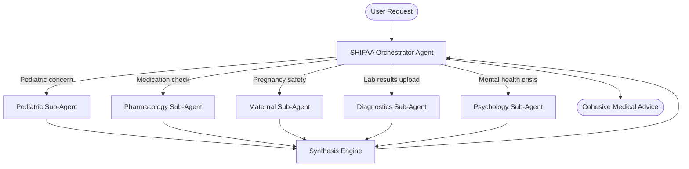

# SHIFAA: Multi-Agent Medical Orchestrator Architecture

If the ultimate goal is to build a system where an **Orchestrator** delegates to specialized **Sub-Agents** to handle "all the medical things," you are moving from a standard chatbot to a true **Agentic AI System**. 

Here are the features and architectural changes you need to build to achieve this vision:

## 🧠 1. The Core Architecture: The Orchestrator

Right now, your user has to manually select "Pregnancy" or "Triage" screens. In a true multi-agent system, the user talks to **one single input (The Orchestrator)**, which dynamically routes the request.

### How it works in practice:
*User says:* "I am 6 months pregnant and have a terrible headache. Can I take ibuprofen?"
* **Orchestrator** recognizes this requires two specialists.
* It asks the **Maternal Agent**: "Is this symptom normal at 6 months?"
* It asks the **Pharmacology Agent**: "Is ibuprofen safe at 6 months pregnant?"
* The Orchestrator receives the answers, synthesizes them, and replies to the user.

---

## 🚀 2. Features You Need to Add

To build this, you need to implement the following features on the Backend and Frontend:

### Backend Features (The Agent Brain)
1. **Agent Routing Framework (LangChain / AutoGen)**
   - Instead of standard API routes, you need to build a backend framework using LangGraph, CrewAI, or Microsoft AutoGen. These libraries allow you to create agents with distinct "personas" and let them talk to each other.
2. **Medical RAG (Retrieval-Augmented Generation)**
   - Sub-agents shouldn't guess. You need to connect them to actual medical databases.
   - *Feature*: Build a Vector Database (like Pinecone or pgvector) loaded with verified medical guidelines (FDA labels, WHO guidelines, pediatric dosage charts). When the Pharmacology agent runs, it searches this database first.
3. **Shared Patient Memory (Electronic Health Record - EHR)**
   - *Feature*: Create a centralized database model for the user's "Patient File". Every sub-agent must have read-access to the user's age, allergies, and chronic conditions before generating advice.

### New Sub-Agents to Build
To cover "all medical things," build these specialized agents:
- **Diagnostics Agent**: Can read uploaded PDF blood test results (using OCR) and explain high/low markers.
- **Nutrition/Dietetics Agent**: Creates meal plans for diabetics, hypertensive patients, or pregnant women.
- **Dermatology Agent**: Analyzes uploaded photos of skin rashes or moles (using Computer Vision) and flags concerning features.
- **Mental Health Companion**: Specialized in cognitive behavioral therapy (CBT) techniques, stress relief, and empathetic listening.

### Frontend Features (The User Experience)
1. **"Agent Working" UI Indicators**
   - When the user asks a complex question, the UI shouldn't just show a generic loading spinner. 
   - *Feature*: Show real-time updates like: 
     - 🔄 *Orchestrator analyzing symptoms...*
     - 💊 *Consulting Pharmacy Agent...*
     - 👶 *Consulting Pediatric Agent...*
   - This builds immense trust with the user.
2. **Universal Chat Hub**
   - Replace the fragmented screens with one powerful, universal chat interface. The UI dynamically changes depending on which agent is currently responding (e.g., the bubble turns blue when the Pharmacy agent provides the drug data, and pink when the Maternal agent gives pregnancy advice).

---

## 💡 Summary of Your Next Steps

If you want to start building this Orchestrator system today, your immediate next step is **Backend AI Re-architecture**.

1. **Choose an Agent Framework**: Decide between LangGraph (great for precise control) or CrewAI (great for easy agent collaboration).
2. **Build the "Router"**: Create a single Node.js endpoint that takes a message, analyzes the intent, and decides which of your current services (Pregnancy or Triage) to call.
3. **Build the Synthesis Layer**: Write code that takes the output of multiple services and combines them into one final, safe response for the user.
